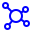

<h1 align="center">
  <br>
    
  <br>
  Hyperledger Fabric Development Network Manager
  <br>
</h1>

<p align="center">
    
    
    
    
    
</p>

> 🚧 **This project is currently under development.** 🚧  
> Expect frequent updates and changes. Your feedback is appreciated!

## Overview

Setting up a Hyperledger Fabric network can be a challenging task, even for experienced professionals. Therefore, this project aims to offer a straightforward way to configure and run a local Hyperledger Fabric network.

<!-- Setting up a Hyperledger Fabric network can be a challenging task, even for experienced professionals. For those who are just starting out, or even for those who simply want to try the network in development mode, building the network can be time-consuming and requires a great deal of knowledge. The Hyperledger Fabric Development Network Manager is an open-source, free-to-use tool that aims to address this challenge by offering high-level abstractions. On the one hand, abstractions hide implementation and configuration details; on the other hand, we don't need to worry about these details if we're just learning how the network works or applying it to a business problem. -->

## Features

- **Set up Orderers**
- **Set up Peers**
- **Set up Channels**
- **Manage the Chaincode Lifecycle**
- **Start/Stop the Network**

## How to execute

> Currently, you can only execute this project by cloning it. However, we are working on developing a Docker image. Therefore, in the coming weeks, you will be able to run it with a single, fast command.

### Prerequisites
- Golang +1.24
- Docker
- NodeJs +22.0

### Executing

- Clone this repository
```sh
git clone https://github.com/gca-research-group/hyperledger-fabric-development-network-manager.git
```

- Start the database
```sh
./.scripts/app/up.sh
```

- Start the backend
```sh
air
```

- Start the frontend
```sh
cd web && npm run start
```

## Contributing

Contributions are welcome! Please read the [contributing guidelines](CONTRIBUTING.md) first.

## License

This project is licensed under the MIT License. See the [LICENSE](LICENSE) file for details.

## Contact

For any questions or issues, please open an issue on GitHub or contact the maintainers.
